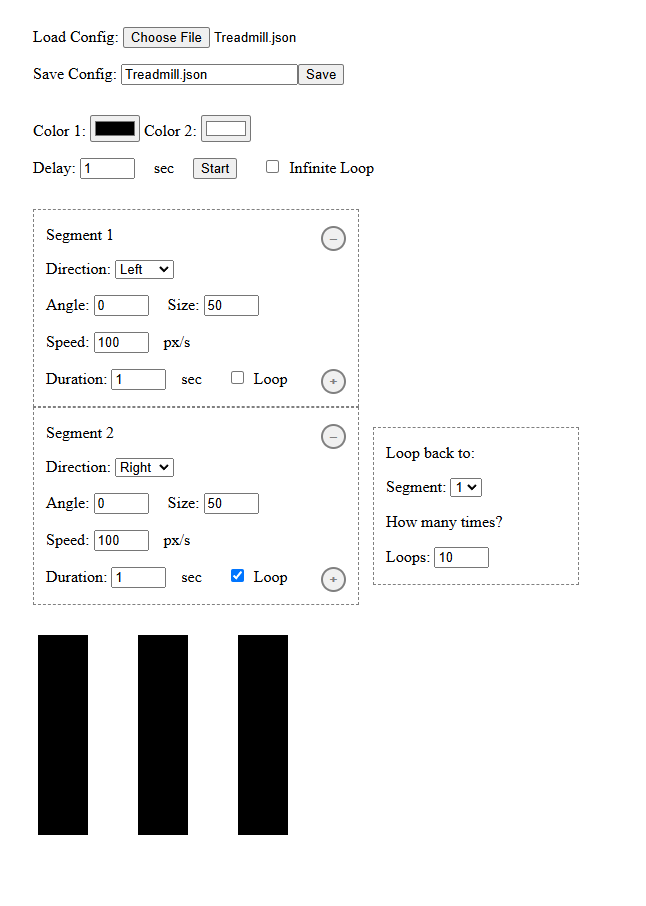

# Optical-Treadmill
An Optical Treadmill program to create animated stripe patterns for animal behavior studies. Requires downloading a single html file to a device which then runs in a browser.

### Features
1. Tap/click on the stripes to enter/exit fullscreen
2. Configure stripe direction, angle, size, speed, and colors.
3. Configure any number of stripe patterns to play in sequence.
4. Set a delay to display a black screen before beginning the stripe sequence to allow for animal habituation.
5. Configure whether to loop through the sequence infinitely or end with a black screen.
6. Save and load configuration files to store settings to be reused.

### Installation
Just download the grating.html file to a device, and open in a browser like chrome.
